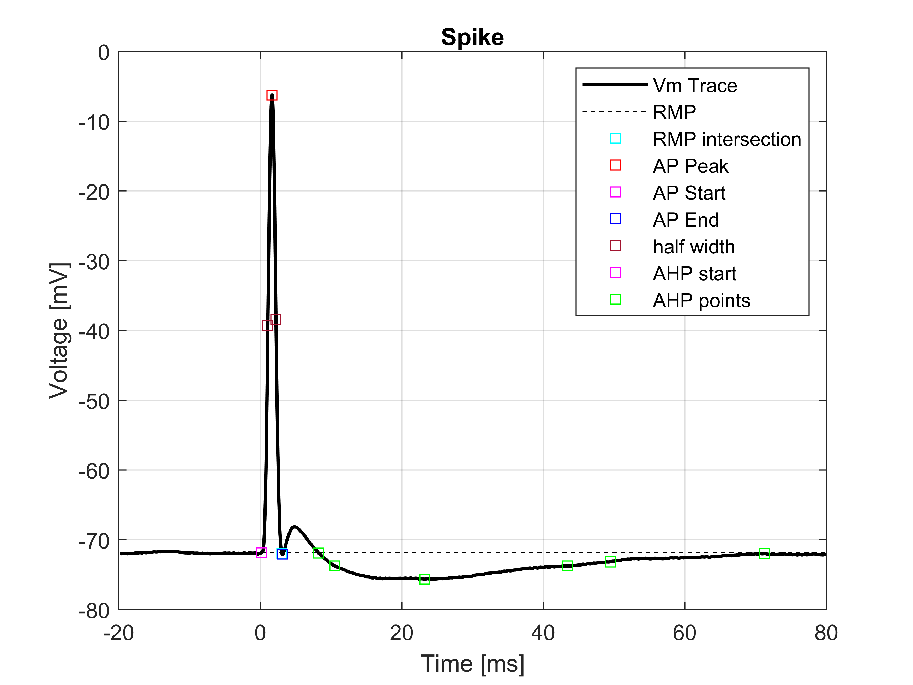
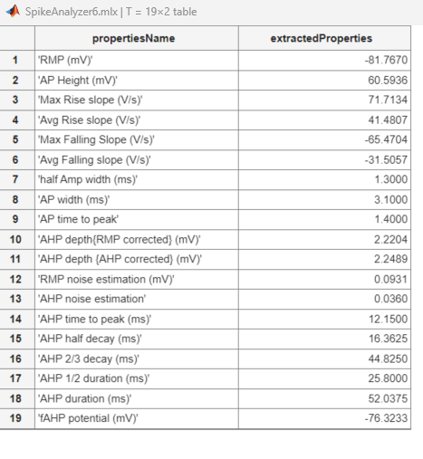
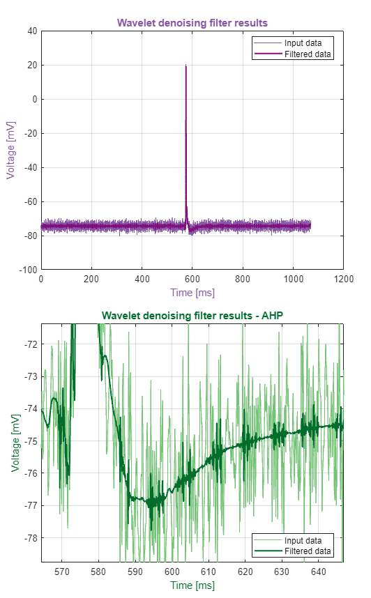

# Motoneuron intracellular data-analysis using MATLAB
This repository contains MATLAB scripts for measuring various intracellular properties from spinal motoneurons' data recorded using sharp electrode.

## Spike Analyzer script:
**A Matlab livescript file to analyze single spikes and extract the following properties:**
### Measurements

1. RMP
2. Action potential Height
3. Max rising slope
4. Average rising slope
5. Max falling slope
6. Average falling slope
7. Action potential half-amplitude width
8. Action potential width
9. AP time to peak (AP start time to the peak time)
10. AHP depth (RMP noise corrected) AHP depth - half of the estimated noise
11. AHP depth (AHP noise corrected)
12. Estimate noise based on the standard deviation of the RMP
13. AHP noise (based on the noise around the mAHP trough)
14. AHP time to rise (AHP start to AHP trough)
15. AHP half-amp decay (time from AHP trough to AHP half-amp point)
16. AHP 2/3 Amp decay (time between spike start to 2/3 AHP decay point)
17. AHP 1/2 Duration (time between the half-amp point on the rising phase and decaying phase)
18. AHP Duration (time from the AHP start to the AHP end)
19. fAHP estimation (AP end voltage)

### Features

1. Interpolation
2. Filtration
3. Robust AP start detection
4. Overlay AHP trace
5. Save filtered and raw data side by side
6. Exponential fitting for the AHP decay
7. Manually selection for the AP start point 
8. Manual selection for AHP peak 
9. New wavelet denoization 
10. HTML export 
--------------------------------------

### Examples

#### Spike Example
 

#### Output Example

#### Denoising Feature Example

## Usage

1. Clone the repository.
2. Open the MATLAB scripts in your MATLAB environment.
3. Run the scripts with your data files to analyze the intracellular properties.

## Testing data
additional spikes files are provided for testing the scripts.